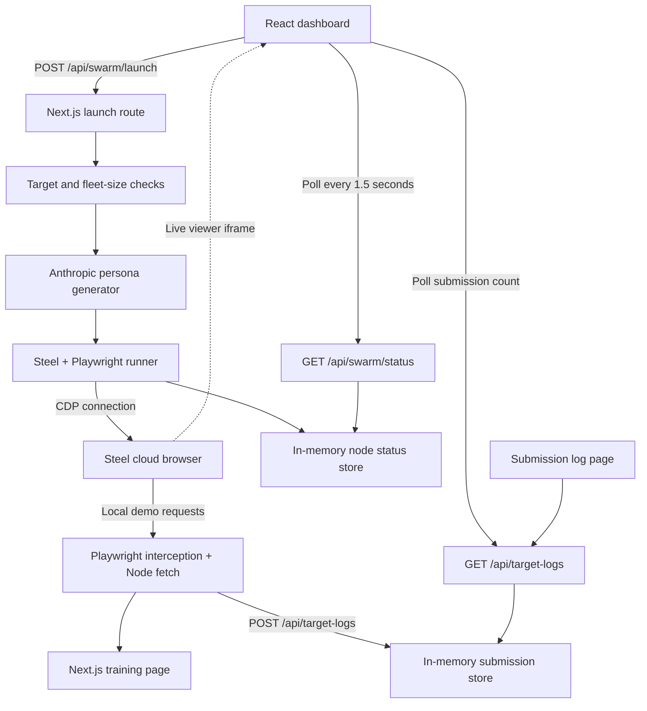

# PhishBait 🎣

A fishing-themed browser-automation demo that generates fictional personas, fills locally hosted training forms with cloud browsers, and records successful submissions.

PhishBait explores whether synthetic records could reduce the usefulness of data collected through phishing. The current prototype demonstrates the automation pipeline on controlled targets; it does **not** establish effectiveness against real phishing operations.

## What it does

- Generates fictional personas through the **Anthropic API**, using Claude.
- Launches **Steel** cloud browsers and controls them with **Playwright**.
- Shows live browser previews and per-node progress on the dashboard.
- Forwards requests for the local demo through Node so Steel can reach the app on your laptop without a public tunnel.
- Records submission summaries in an in-memory log.
- Imports individual HTML pages for review and local rendering.

The bundled English redelivery page is a **fictional reconstruction**, not an exact copy of a verified PhishTank listing. There is no automatic PhishTank search, verification, or multi-page website crawler.

## Quick start

### Requirements

- Node.js **20.18.1 or newer** and npm. The installed Cheerio dependency requires this Node version, even though Next.js itself supports older versions.
- Internet access for the cloud-browser demo.
- An **Anthropic API key** and **Steel API key** for automated runs.
- Google Chrome only if you want to run the local browser test script. Normal Steel runs do not require a locally installed browser.

### Install and configure

Run from the repository root:

```bash
npm install
```

For a first-time setup, copy the environment template. Do not overwrite an existing `.env.local` containing your keys:

```bash
cp .env.example .env.local
```

Edit `.env.local`:

```dotenv
STEEL_API_KEY=your_steel_api_key
ANTHROPIC_API_KEY=your_anthropic_api_key
ANTHROPIC_MODEL=claude-sonnet-4-6
```

Then start the app:

```bash
npm run dev
```

Open **http://localhost:3000**. Keep this terminal running. Stop it with **Ctrl+C** before restarting after environment changes.

The dev command explicitly uses port 3000. A second launch will report `EADDRINUSE` instead of silently starting another server on port 3001. Run only one dev server per checkout: multiple servers can overwrite the same `.next` build cache.

### API accounts and billing

| Service | Used for | Configuration |
|---|---|---|
| Anthropic | Generating fictional persona records | `ANTHROPIC_API_KEY` |
| Steel | Cloud browser sessions, previews, and browser features | `STEEL_API_KEY` |

The accounts have separate balances. Anthropic credits do not pay for Steel usage. The app calls Anthropic directly; it does not require OpenRouter or an OpenAI API key. The `openai` package remains in the dependency list but is not used by the current persona generator.

For localhost targets, the runner disables proxies and CAPTCHA solving. Normal Steel usage and concurrency limits still apply. For non-local targets, the current runner enables both features; Steel may reject those requests based on the API key's account or paid-balance eligibility. The dashboard displays the provider's session-creation error with configured API keys redacted.

## Run the demo

### Manual form demo — no API keys required

1. Open http://localhost:3000/clone-portal/english-redelivery.
2. Click **Fill sample data**.
3. Click **Confirm demo redelivery**.
4. Open http://localhost:3000/scammer-db to see the submitted record.

The English form validates required fields and email format. **Reset form** clears inputs, and the expandable help explains the scenario. Failed saves preserve the entered values. The page saves a summary, not every field's contents.

### Automated browser demo

1. Start the app and open http://localhost:3000.
2. Select **Clone: English Package Redelivery (Training)**. The original mock at `/target-portal` is also available and is the default target.
3. Leave the fleet size at **1** for the first run.
4. Click **Unleash Swarm**.
5. Watch the node progress through `booting`, `navigating`, `filling`, and `submitted`.
6. Match the persona's name to its entry in `/scammer-db`.
7. After all sessions end, optionally increase the fleet size within your Steel account's concurrency allowance. The app accepts integers from 1 to 10.

A node is marked `submitted` only after Playwright observes a successful response to `POST /api/target-logs` on the target origin. The runner keeps the browser open for another 15 seconds, then closes it and attempts to release the Steel session. The dashboard replaces ended previews with the final result.

**“Records Poisoned” counts submissions received by this demo.** The **“scammer database” is the app's local submission log**, not a connection to a real criminal database. Use **flush** on that page to clear the current log; this resets the shared demo counter as well.

A preview showing **Browser Disconnected** does not by itself establish that submission failed. The preview and browser automation have separate connections. Check the matching persona in the log and the node's final status before rerunning.

### Suggested presentation sequence

1. **Why:** Explain the hypothesis of making collected phishing data less useful with synthetic records.
2. **What:** Show the fictional training target and identify it as a reconstruction.
3. **How:** Explain that Claude creates data, Steel hosts browsers, Playwright drives them, and Next.js coordinates the run.
4. **Demonstrate:** Launch one node and show the live form filling.
5. **Prove:** Match the browser persona to a confirmed submission in the log.
6. **Qualify:** Explain that real-world effectiveness, filtering resistance, and arbitrary-site compatibility remain untested.

Keep the dashboard, training page, and log in separate tabs. Rehearse before presenting and keep API keys off screen. The older [DEMO.md](DEMO.md) contains additional presentation ideas; use this README for current behavior and provenance, especially for the English reconstruction.

## Architecture



### Launch lifecycle

1. The launch API checks the target URL, allowlist, fleet size, and required keys.
2. `lib/persona.ts` makes one Anthropic Messages API request for the requested number of personas. It checks JSON structure, record count, and required string fields, then adds payment test-card data locally.
3. The launch route attempts Steel session creation in parallel. `Promise.allSettled` preserves successful nodes if another creation fails.
4. Each runner attaches Playwright over CDP, reuses the existing browser page, and installs the local relay when appropriate.
5. The runner checks navigation success, waits for the bundled form's readiness marker, fills matching fields, and waits for a successful submission response.
6. Status updates are kept in a process-local store and polled by the dashboard. Browser work continues asynchronously after session creation; the launch response does not mean every submission has finished.
7. Cleanup closes the browser and attempts to release its Steel session. A release failure is included in the node's message.

### How localhost access works

Inside a cloud browser, `localhost` normally means the cloud machine. `lib/localDemoRelay.ts` intercepts selected HTTP requests and fulfills them using `fetch` in the local Node process instead.

For a local target, the relay permits only the same origin and:

- `GET`/`HEAD` for the selected page, `/_next/` assets, `/clones/` assets, and `/favicon.ico`.
- `POST /api/target-logs` for the demo submission.

Other requests are aborted. The launch route limits local targets to `/target-portal` and `/clone-portal/<slug>`. This is a narrow demo relay, not a general proxy: it does not forward authentication cookies or WebSocket traffic and is not designed for arbitrary multi-page workflows. Keep the local server running for the entire browser session.

### Data and state

| Data | Location and lifetime |
|---|---|
| Personas | Generated for each launch; used by the runner without a persistent persona database |
| Submission summaries | `lib/store.ts`, held on `globalThis` within the Node process |
| Node status | `lib/swarmStore.ts`, held on `globalThis`; completed history is pruned when the map exceeds 100 entries |
| Clone markup and manifest | Files under `content/clones/` |
| Downloaded clone assets | Files under `public/clones/`, when produced by the import script |

A saved submission contains `id`, `receivedAt`, `fullName`, `email`, and `fieldsFilled`. The log API returns the total count and up to 50 newest entries. Address, phone, notes, and payment-field values are not stored by this endpoint.

The persona prompt requests fictional names, `example.com` email addresses, fake phone details, and placeholder identifiers. Payment numbers come from a fixed list of test values in the code, not model generation. The English training form does not request payment details; the original mock includes test-payment fields.

Both runtime stores usually survive development hot reloads, but reset when the server process restarts. They are not shared across separate server processes.

## Project structure

| Path | Responsibility |
|---|---|
| `app/page.tsx` | Fleet controls, live previews, counts, polling, and node results |
| `app/layout.tsx` | Shared document layout and browser-tab metadata |
| `app/globals.css` | Global styles and the dashboard's fishing theme |
| `app/target-portal/page.tsx` | Original fictional redelivery form |
| `app/clone-portal/[slug]/page.tsx` | Loads a clone file, validates its slug, and sanitizes it |
| `components/ClonedFormRenderer.tsx` | Local submission handling, validation, sample fill, reset, and feedback |
| `app/scammer-db/page.tsx` | Submission log and flush control |
| `app/api/swarm/launch/route.ts` | Launch validation and persona/session coordination |
| `app/api/swarm/status/route.ts` | Node-status polling endpoint |
| `app/api/target-logs/route.ts` | Read, append, and reset submission summaries |
| `app/api/clones/route.ts` | Reads the clone manifest |
| `lib/persona.ts` | Anthropic request, persona validation, and local test-card data |
| `lib/steelRunner.ts` | Browser creation, filling, confirmation, and cleanup |
| `lib/localDemoRelay.ts` | Restricted request forwarding for local demos |
| `lib/targetGuard.ts` | Domain allowlist checks |
| `lib/sanitizeClone.ts` | Render-time HTML sanitization |
| `lib/steelError.ts` | Session-creation error formatting and key redaction |
| `lib/store.ts`, `lib/swarmStore.ts`, `lib/types.ts` | Runtime stores and shared types |
| `content/clones/` | HTML fixtures and `index.json` manifest |
| `scripts/clone-phish.mjs` | Single-page HTML import utility |
| `scripts/tests/` | Mocked checks, browser checks, and an opt-in Steel smoke test |

## Configuration

Put server configuration in `.env.local` at the repository root.

| Variable | Default | Meaning |
|---|---|---|
| `ANTHROPIC_API_KEY` | None | Required for automated persona generation |
| `ANTHROPIC_MODEL` | `claude-sonnet-4-6` | Model ID sent directly to Anthropic |
| `STEEL_API_KEY` | None | Required for cloud browser sessions |
| `NEXT_PUBLIC_APP_URL` | `http://localhost:3000` | Origin used to construct dashboard quick-select target URLs; public, not a secret |
| `ALLOWLIST_DOMAINS` | `localhost,127.0.0.1` | Comma-separated permitted hostnames; matches exact hosts and subdomains |
| `ALLOW_LIVE_TARGETS` | Unset | Setting `true` bypasses the domain allowlist and produces a warning; leave unset for the local demo |
| `TEST_APP_URL` | Depends on test script | Test-only origin override; use `http://localhost:3000` in the browser-test command below |

Setting `ALLOWLIST_DOMAINS` **replaces** the default list. Include `localhost,127.0.0.1` if you still need them. The relay recognizes IPv6 loopback, but `[::1]` must also be explicitly allowlisted to pass the default target guard.

For an owned remote deployment, configure its origin and allowlisted hostname. Set `NEXT_PUBLIC_APP_URL` before building because it is included in the client bundle. The remote target must expose the submission endpoint expected by the runner; simply allowing an arbitrary website does not make its forms compatible.

## Importing a page

Use a page you control or have permission to inspect. The import command fetches the source and linked assets over the network; it is separate from the local demo run.

```bash
npm run clone -- "https://your-owned-site.example/training" training-page "Training Page"
```

Replace the example URL with your source page. The command writes:

```text
content/clones/training-page.html
content/clones/index.json
public/clones/training-page/
```

It fetches one HTML page, removes scripts and inline event handlers, neutralizes forms, and attempts to download images and stylesheets. It does not crawl navigation, translate text, recreate application logic, or guarantee that downloaded assets are fully self-contained.

At render time, `sanitizeClone` applies stricter rules: scripts, stylesheets, inline styles, embedded content, resource URLs, link destinations, and unsupported attributes are removed. **Original images and CSS may therefore not render, even if the import script downloaded them.** Supported markup and approved class tokens remain. This favors inert training content over visual fidelity.

Review the imported HTML before using it. Refresh the dashboard to reload its clone list, then open `/clone-portal/training-page`. Missing files or invalid slugs return a not-found page.

For a reviewed legacy button that should submit its surrounding form, add:

```html
<button type="button" data-phishbait-submit="true">Confirm</button>
```

Use normal `type="submit"` and `type="reset"` buttons when possible. Stripped JavaScript widgets and multi-step flows require explicit implementation; they do not automatically work after import.

## Verification

### Type checking and mocked checks

These commands do not call Anthropic or create Steel sessions:

```bash
npx tsc --noEmit
node scripts/tests/persona-api.mjs
node scripts/tests/swarm-runner.cjs
```

They cover persona request/response handling, validation and API errors, local relay restrictions, submission confirmation, and browser cleanup using mocks.

### Local browser checks

With one dev server already running and Google Chrome installed, run in another terminal:

```bash
TEST_APP_URL=http://localhost:3000 node scripts/tests/clone-demo.mjs
```

This checks the English form's validation, sample fill, reset, help, duplicate-submit prevention, success/error handling, and clone discovery. Submission responses are mocked; no paid APIs are used. The explicit origin is important because this script otherwise defaults to port 3011.

### Real Steel smoke test — consumes browser usage

With the app running and `STEEL_API_KEY` set in `.env.local`:

```bash
node scripts/tests/steel-local-smoke.cjs
```

This creates one real Steel browser, uses a fixed fictional persona, submits to the English local demo, and waits for cleanup. It does not call Anthropic. It adds a `Steel Connection Test` record to the demo log. Check the Steel dashboard if the script is interrupted or reports cleanup failure.

`npm run lint` invokes Next.js linting, but this repository does not currently include an ESLint configuration; it may prompt for setup. It is not an established noninteractive check.

## Troubleshooting

| Symptom | Explanation and next step |
|---|---|
| `EADDRINUSE` on port 3000 | Another server is already listening. Open the app or stop that server before restarting; do not start a second instance on another port in this checkout. |
| `missing required error components` or missing `.next/vendor-chunks/...` files | The generated cache may be inconsistent, especially after competing dev/build processes. Stop all PhishBait Next.js processes before rebuilding the cache as described below. |
| Missing `ANTHROPIC_API_KEY` / `STEEL_API_KEY` | Save the correctly named key in root `.env.local`, then restart the existing server. |
| Anthropic `401` | Check that the key is an Anthropic API key for the intended account. OpenRouter keys are not interchangeable. |
| Anthropic credits or rate-limit error | Check the Anthropic account tied to that key. Steel credit cannot cover persona generation. |
| OpenRouter `402` or old model endpoint errors | The current generator no longer calls OpenRouter. Confirm you are running this checkout and restart stale server processes. |
| Steel `403` mentioning paid balance, proxies, or CAPTCHA solving | Local demo targets disable these features. For a non-local target, inspect Steel's exact eligibility error and the account associated with the key. A displayed balance alone does not establish feature eligibility. |
| Some Steel sessions fail to create | Read the provider error shown on that node. Try one browser and check active sessions/account concurrency limits; balance is only one possible cause. |
| Preview shows an X or `Browser Disconnected` | Check the final node status and the matching log record. A live-preview disconnect can occur independently of submission. Ended sessions are intentionally released. |
| `No submit button` or submission timeout | The target may not match the selector heuristics, may fail browser validation, or may not POST to `/api/target-logs`. Test the bundled English form first. |
| Local page navigation fails | Keep the app running on the target port. The relay only forwards the selected demo page and its permitted requests. |
| Log entries disappear | Runtime data is in memory and resets on server restart or when the log is flushed. |
| Thousands of Git changes after install | Check `.gitignore`: dependencies, `.next`, and local environment files should be ignored. Commit source files and `package-lock.json`, not `node_modules` or API keys. |

### Rebuild the development cache

First stop **all** Next.js dev/build processes for this checkout, including background servers. Then run:

```bash
node -e "require('node:fs').rmSync('.next', { recursive: true, force: true })"
npm run dev
```

This removes generated build output only. It does not remove source files, installed dependencies, or `.env.local`. Refresh the browser after the server is ready.

## Build and deployment limits

Stop the dev server before building in the same checkout:

```bash
npm run build
npm run start
```

The application needs a persistent Node process and writable/readable local project files for its current workflow. Asynchronous browser tasks and process-local stores are not suitable for request-scoped serverless execution or multiple replicas without a job queue and shared storage.

This is a controlled-demo prototype. Its API routes have no user authentication, and the log endpoint can be read, appended to, or cleared by callers who can reach it. Add authentication, request validation, rate limits, durable storage, and managed background jobs before exposing a deployment beyond a trusted environment.

Additional limitations:

- Form automation uses selector heuristics and only fills the first matching element per mapping. It is not a general autonomous website agent.
- Submission confirmation is tied to this project's `/api/target-logs` contract.
- The HTML sanitizer and import utility are project-specific, not a complete browser security boundary or full-site cloning system.
- The allowlist is a hostname check, not a comprehensive network isolation mechanism.
- Closing or restarting the server can interrupt jobs before cleanup; check Steel for remaining sessions.
- Reloading the dashboard does not restore a previous fleet's UI state, although the submission log remains available while its server process survives.
- Synthetic-data impact against real phishing systems has not been measured.

Use fictional data and targets you own or are authorized to test. A PhishTank report is provenance to review, not permission to send automated traffic to the reported website.
